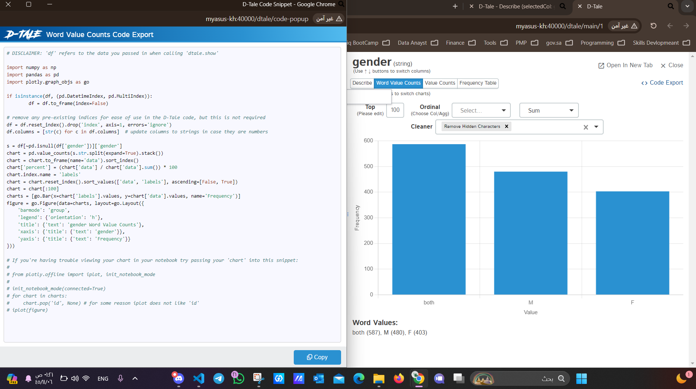

**Usecase 5 - Analysis of Employment Landscape in Saudi Arabia**

**Overview**
This project aims to analyze the employment landscape across different regions in Saudi Arabia. It focuses on understanding the distribution of job postings, exploring any gender preferences in these listings, analyzing salary ranges, and the opportunities available for both fresh graduates and experienced professionals.

**Steps in the Project**
**Step 1:** Defining the Problem Statement
The initial phase involves outlining the key questions to be addressed about the employment landscape in Saudi Arabia:

Regional distribution of job postings
Presence of gender preferences in job postings
Expected salary ranges
Opportunities for fresh graduates versus experienced professionals

**Step 2:** Collecting Data
Data is sourced from Jadara, containing comprehensive job postings within Saudi Arabia.

**Step 3:** Data Quality Checking and Remediation
This step ensures the integrity of the data by checking for inconsistencies or missing values and applying necessary corrections.

**Step 4:** Exploratory Data Analysis
An in-depth analysis is conducted to uncover trends and patterns in the employment data.

**Step 5-9:** Building Models, Evaluation, Communication, Deployment, and Maintenance
These steps are marked as not applicable for this project as the primary focus is on data analysis rather than model building and deployment.

**Tools and Technologies**
Python for data manipulation and analysis
Jupyter Notebooks for interactive code execution and data exploration
Running the Project
To run the analysis, ensure you have Python installed and the required libraries (pandas, matplotlib, seaborn) loaded. Clone the project, navigate to the project directory, and run the Jupyter Notebook.

**A1 What proportion of job postings is attributed to each region within the kingdom?**

**A2 Is there a gender preference indicated in the job postings?**

**A3 What is the expected salary range for fresh graduates?**

**A4 Are job opportunities predominantly targeted at individuals with experience, or is there room for fresh graduates as well?**

**Visualizations:**

Proportion of Job Postings by Region

Gender Preferences in Job Postings

Expected Salary Range for Fresh Graduates

Job Opportunities by Experience Requirement

**Summary of Insights**

Proportion of Job Postings by Region

The majority of job postings are concentrated in Riyadh (42.31%), followed by Makkah Al-Mukarramah (25.10%) and the Eastern Province (14.90%).

**Gender Preferences in Job Postings**

Most job postings are open to both genders (587), followed by male-preferred postings (480) and female-preferred postings (403).

**Expected Salary Range for Fresh Graduates**

The average salary for fresh graduates is approximately 4876 SAR, with most salaries ranging between 3000 SAR and 5000 SAR.

**Job Opportunities by Experience Requirement**

The majority of job postings require 0 years of experience (833), indicating a significant number of opportunities for fresh graduates.

There are also notable opportunities for individuals with 2 years of experience (436).

**Bounce Question:**

How does the distribution of job postings vary across different company sizes in Saudi Arabia?

What is the relationship between job posting frequency and the economic activity of companies in Saudi Arabia?

**Authors**
Eng. Khalid Saeed
Acknowledgements
Special thanks to Jadara for providing access to the dataset necessary for this analysis.